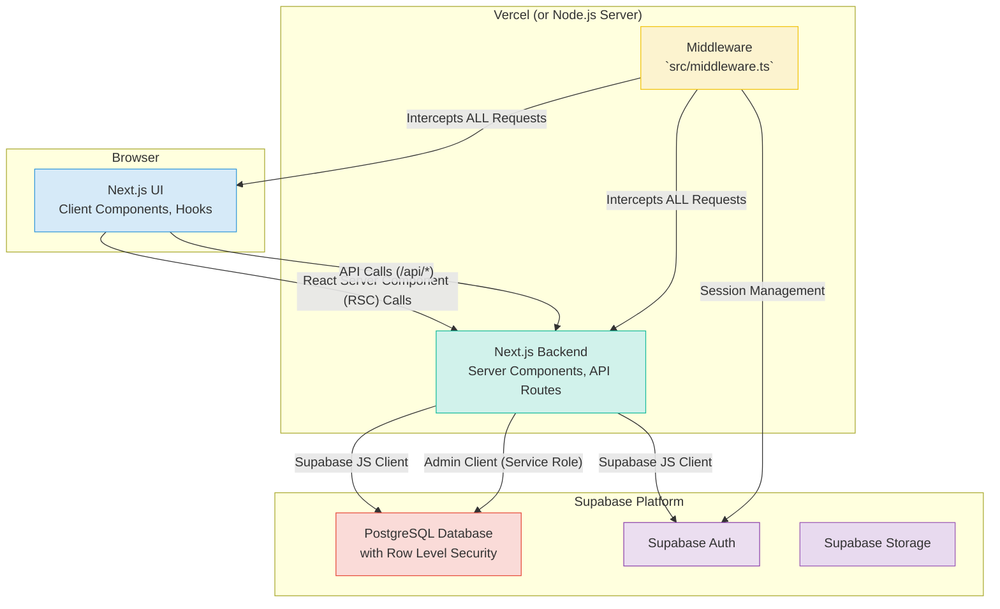
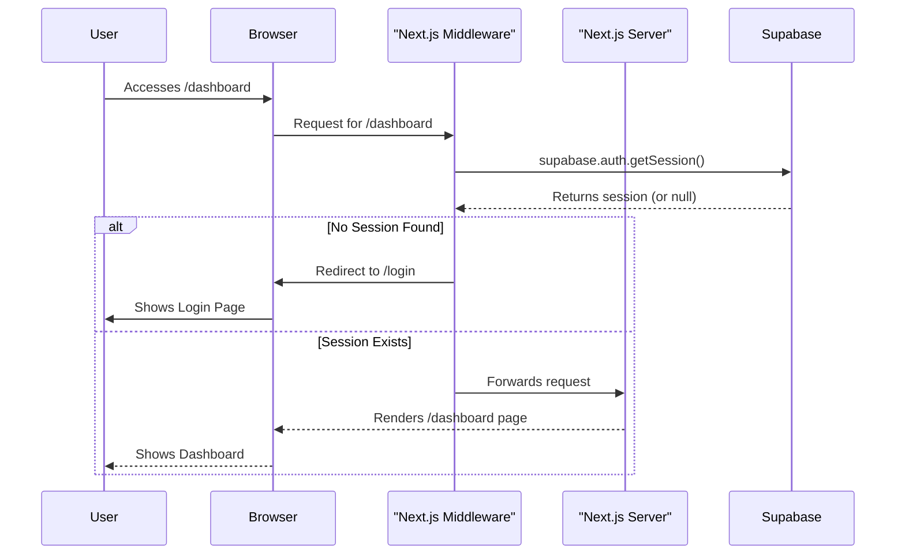
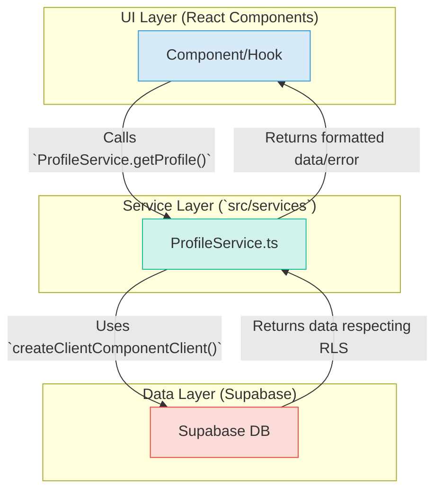
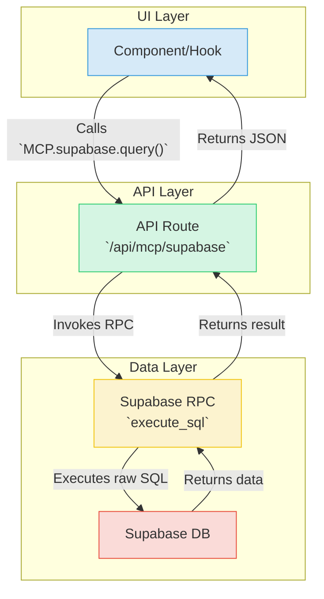

# CMG Dashboard - Advanced Marketing Agency CRM

<p align="center">
  
</p>

<h1 align="center">CMG Dashboard</h1>

<p align="center">
  A comprehensive, multi-tenant CRM platform engineered for modern marketing agencies.
</p>

<p align="center">
  <a href="https://nextjs.org" target="_blank"></a>
  <a href="https://supabase.io" target="_blank"></a>
  <a href="https://tailwindcss.com" target="_blank"></a>
  <a href="https://www.typescriptlang.org/" target="_blank"></a>
  <a href="https://jestjs.io/" target="_blank"></a>
  <a href="https://prettier.io" target="_blank"></a>
  <a href="#"></a>
</p>

---

CMG Dashboard is a powerful, enterprise-ready CRM designed to be the central nervous system for marketing agencies. It provides a rich suite of tools for managing clients, projects, and finances, all within a secure, multi-tenant architecture.

### TOC

- [✨ Key Features](#-key-features)
- [🏛️ Technical Architecture](#️-technical-architecture)
- [🔑 Authentication Flow](#-authentication-flow)
- [💾 Data Flow Architecture](#-data-flow-architecture)
- [🛠️ Tech Stack](#️-tech-stack)
- [🎨 Design System](#-design-system)
- [🚀 Getting Started](#-getting-started)
- [⚙️ Development Workflow](#️-development-workflow)
- [📂 Codebase Guide](#-codebase-guide)
- [🚢 Deployment](#-deployment)
- [🌱 Contributing](#-contributing)

---

## ✨ Key Features

- **🏢 Multi-Tenant Agency Management:** Securely manage multiple agencies, each with its own isolated data, clients, and team members, enforced by RLS.
- **👥 Comprehensive Client Profiles:** Maintain detailed client records, including contacts, project history, and communication logs.
- **🧾 Financial Tracking:** Create, send, and track invoices with status management (Draft, Sent, Paid, Overdue).
- **📊 Advanced Analytics:** A rich dashboard with customizable widgets to visualize key performance indicators (KPIs) for clients and agency performance.
- **🔐 User & Role Management:** Granular control over team members with distinct roles and permissions.
- **⚙️ Centralized Settings:** Manage agency-wide settings, including branding, billing, and security configurations.
- **🔔 Real-time Notifications:** In-app notification system to keep users informed of important events.
- **🌓 Themeable Interface:** A sleek and modern UI with full support for both Light and Dark modes.

---

## 🏛️ Technical Architecture

The application is built on a robust, scalable architecture leveraging Next.js and Supabase.



---

## 🔑 Authentication Flow

Authentication is managed by Supabase Auth and protected by route middleware. This sequence diagram illustrates the process for a protected route.



- **JWT-based Auth:** Supabase handles user authentication, issuing JWTs that are stored securely in `HttpOnly` cookies.
- **Middleware Protection:** All incoming requests are intercepted by `src/middleware.ts`, which refreshes user sessions and redirects unauthenticated users.
- **Security Headers:** The middleware also enforces strict Content Security Policies (CSP) and other security headers (`X-Frame-Options`, etc.) for all responses.

---

## 💾 Data Flow Architecture

This project employs a service-oriented architecture for interacting with the database.

### Recommended Pattern: Service Layer

All new features **must** use the service layer pattern. This centralizes data logic, improves reusability, and respects Supabase RLS policies by default.



### Legacy Pattern: MCP (Model Context Protocol)

This pattern is deprecated and should be refactored when possible. It involves an extra API round-trip and relies on a backend function that executes raw SQL.



<br/>

---

## 🛠️ Tech Stack

This project leverages a curated set of modern technologies for a performant and developer-friendly experience.

| Category          | Technology                                                                                                          | Purpose                                                 |
| ----------------- | ------------------------------------------------------------------------------------------------------------------- | ------------------------------------------------------- |
| **Framework**     | [Next.js](https://nextjs.org/) (v15)                                                                                | Full-stack web framework with App Router                |
| **Backend & DB**  | [Supabase](https://supabase.io/)                                                                                    | Database, Authentication, and Storage                   |
| **Styling**       | [Tailwind CSS](https://tailwindcss.com/)                                                                            | Utility-first CSS framework                             |
| **UI Components** | [Radix UI](https://www.radix-ui.com/)                                                                               | Headless components for accessibility and functionality |
| **State**         | [Zustand](https://github.com/pmndrs/zustand)                                                                        | Minimalist global client-side state management          |
| **Forms**         | [React Hook Form](https://react-hook-form.com/) & [Zod](https://zod.dev/)                                           | Efficient form handling and robust schema validation    |
| **Charting**      | [Chart.js](https://www.chartjs.org/) & [Recharts](https://recharts.org/)                                            | Data visualization                                      |
| **Icons**         | [Lucide React](https://lucide.dev/)                                                                                 | Simply beautiful and consistent icons                   |
| **Language**      | [TypeScript](https://www.typescriptlang.org/)                                                                       | End-to-end type safety                                  |
| **Linting**       | [ESLint](https://eslint.org/) & [Prettier](https://prettier.io/)                                                    | Code quality and consistent formatting                  |
| **Testing**       | [Jest](https://jestjs.io/) & [React Testing Library](https://testing-library.com/docs/react-testing-library/intro/) | Unit and integration testing                            |

---

## 🎨 Design System

The UI is built upon a flexible and themeable design system.

- **CSS Variables:** The entire color palette and styling primitives (borders, radii) are powered by CSS variables defined in `src/app/globals.css`, allowing for dynamic theming.
- **Theming:** Light and dark modes are managed by `next-themes`. The theme is applied globally by adding a `dark` or `light` class to the `<html>` element.
- **Fonts:** The project uses `Geist Sans` for UI text and `Geist Mono` for code snippets, loaded via `next/font`.
- **Animation:** UI animations are handled with `tailwindcss-animate`.

---

## 🚀 Getting Started

Follow these steps to set up and run the project locally.

### 1. Prerequisites

- **Node.js:** `v18.17.0` or higher.
- **npm:** `v8.x` or higher.
- **Supabase Account:** Access to the project's Supabase instance.

### 2. Clone the Repository

```bash
git clone <your-repository-url>
cd cmg-dashboard
```

### 3. Install Dependencies

```bash
npm install
```

### 4. Configure Environment Variables

Create a `.env.local` file in the project root.

<details>
<summary><strong>Click to see `.env.local` configuration</strong></summary>

```properties
# .env.local

# REQUIRED
# Found in your Supabase project settings under API > Project API Keys
SUPABASE_SERVICE_ROLE_KEY=your-supabase-service-role-key

# OPTIONAL (but recommended for production)
# These are hardcoded in the app but should be moved here.
# Found in your Supabase project settings under API.
NEXT_PUBLIC_SUPABASE_URL=your-supabase-url
NEXT_PUBLIC_SUPABASE_ANON_KEY=your-supabase-anon-key
```

</details>

### 5. Setup Database & Types

The project relies on a pre-existing database schema on Supabase.

> ⚠️ **Important: No Migrations**
> This repository does not contain SQL migration files. For local development, you must get a SQL schema dump from the project lead or connect to a shared development database.

Once your database is accessible, generate TypeScript types for full type-safety:

```bash
npm run db:types
```

This script introspects your Supabase schema and generates `src/types/supabase.ts`.

### 6. Run the Development Server

```bash
npm run dev
```

The application will be available at `http://localhost:3000`.

---

## ⚙️ Development Workflow

### Available Scripts

<details>
<summary><strong>Click to see available npm scripts</strong></summary>

| Script             | Description                                         |
| ------------------ | --------------------------------------------------- |
| `npm run dev`      | Starts the Next.js development server.              |
| `npm run build`    | Creates a production build. **Do not use for dev.** |
| `npm run start`    | Starts a production server.                         |
| `npm run lint`     | Lints the codebase for errors.                      |
| `npm run test`     | Runs all Jest tests.                                |
| `npm run db:types` | Generates TypeScript types from Supabase schema.    |

</details>

### Coding Standards

- **Follow Existing Patterns:** Adhere to the architecture and patterns established in the codebase.
- **Services for DB Interaction:** All database operations must be encapsulated within service classes in `src/services/`.
- **Error Handling:** Use centralized error handlers and the `AppError` class for throwing exceptions.
- **Environment Variables:** All secrets and environment-specific configurations must be handled through environment variables.

### Testing

The project uses Jest and React Testing Library. Test files are co-located with their corresponding modules in `__tests__` directories.

- Run all tests with `npm test`.
- Run tests for a specific area (e.g., services) with `npm run test:services`.

---

## 📂 Codebase Guide

| Path                 | Description                                                                                          |
| -------------------- | ---------------------------------------------------------------------------------------------------- |
| `src/app/`           | **Routes & Pages:** All application routes, layouts, and pages, following the App Router convention. |
| `src/app/dashboard/` | Core CRM feature modules (Clients, Invoices, Analytics, etc.).                                       |
| `src/components/`    | **Reusable UI:** Shared React components (buttons, cards, inputs).                                   |
| `src/services/`      | **Business Logic:** Service classes that encapsulate all interactions with the Supabase backend.     |
| `src/lib/`           | **Core Utilities:** Helpers, constants, and configuration files.                                     |
| `src/lib/schemas/`   | **Zod Schemas:** Validation schemas for forms and API data.                                          |
| `src/lib/stores/`    | **Zustand Stores:** Definitions for global client-side state.                                        |
| `src/context/`       | **React Context:** Application-wide providers (e.g., `AuthProvider`).                                |
| `src/types/`         | **TypeScript Types:** Global type definitions. `supabase.ts` is auto-generated.                      |
| `src/middleware.ts`  | **Security & Routing:** Intercepts requests for authentication, redirection, and security headers.   |

---

## 🚢 Deployment

This application is designed for deployment on [Vercel](https://vercel.com).

- **Environment Variables:** Ensure all required environment variables (especially `SUPABASE_SERVICE_ROLE_KEY`) are set in the Vercel project settings.
- **Build Command:** Vercel will automatically use `npm run build`.
- **Domains:** Assign your custom domain in the Vercel project settings.

---

## 🌱 Contributing

We welcome contributions! Please follow these steps:

1.  Fork the repository.
2.  Create a new feature branch (`git checkout -b feature/your-feature-name`).
3.  Commit your changes (`git commit -m 'feat: Add some amazing feature'`).
4.  Push to the branch (`git push origin feature/your-feature-name`).
5.  Open a Pull Request for review.
